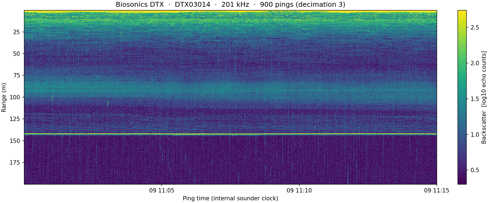

# rdbiosonics

Read **Biosonics DTX `.DT4`** echosounder files into
[xarray](https://docs.xarray.dev).

`rdbiosonics` is a small, standalone Python port of the MATLAB `rddtx.m`
reader (Rich Pawlowicz, UBC). It decodes the DT4 binary record format and
returns an `xarray.DataTree` with groups loosely following the
[echopype](https://echopype.readthedocs.io) / SONAR-netCDF4 layout:
`Beam`, `Environment`, `Platform`, and `Vendor_specific`.

The decode is verified against the original MATLAB code (exact equality on
backscatter, range, and ping number), with two genuine `rddtx.m` bugs fixed.

## Install

Development uses [pixi](https://pixi.sh):

```bash
pixi install      # create the environment
pixi run test     # run the tests
pixi run docs     # build the documentation
```

Or install with pip: `pip install .`

## Usage

```python
from rdbiosonics import rddtx

dt = rddtx("example_data/Bark2620260509_110000.dt4")
backscatter = dt["Beam"]["backscatter"]   # (ping_time, range_sample)
```

Pass a list of paths to chain split files, and `numdec` to control the
in-time median decimation (default `3`, which suppresses interference from
other sounders).

## Echogram

`examples/plot_echogram.py` reads a file and plots an echogram:

```bash
pixi run echogram
```



## Documentation

Full docs (quickstart, echogram example, API reference) are in `docs/` and
build with `pixi run docs`. They are also set up for
[Read the Docs](https://readthedocs.org) via `.readthedocs.yaml`.

## License

MIT
